# Student Organization Management System (SOMS)

Student Organization Management System (SOMS) is a full-stack web application for managing campus student organizations, members, events, announcements, and event registrations.

Administrators can create and manage organizations, post events, publish announcements, view users, and manage members. Students can browse organizations, join organizations, view announcements, and register for events.

## Live Links

- Frontend: <https://student-org-93ky.vercel.app>
- Backend API: <https://student-org-1-s1pk.onrender.com>
- Swagger API Docs: <https://student-org-1-s1pk.onrender.com/api/docs>

## Tech Stack

| Layer | Technology |
|---|---|
| Frontend | Angular 18, Tailwind CSS, RxJS |
| Backend | Node.js, Express, TypeScript |
| Database | MongoDB Atlas, Mongoose |
| Authentication | JWT, bcryptjs |
| File Upload | Multer |
| Validation | Zod |
| API Documentation | Swagger |

## Repository Structure

```text
soms/
├── client/       Angular frontend
├── server/       Express API
├── screenshots/  UI and API testing screenshots
├── render.yaml   Render deployment config
└── README.md     Project documentation
```

## Local Setup

### Backend

```bash
cd server
npm install
npm run dev
```

Backend local URL:

```text
http://localhost:5000
```

Backend API docs:

```text
http://localhost:5000/api/docs
```

Create `server/.env`:

```env
PORT=5000
NODE_ENV=development
MONGO_URI=your_mongodb_connection_string
JWT_SECRET=your_jwt_secret
JWT_EXPIRES_IN=7d
CLIENT_ORIGIN=http://localhost:4200
MAX_FILE_SIZE_MB=5
ADMIN_EMAIL=admin@example.com
ADMIN_PASSWORD=ChangeMe123
ADMIN_NAME=Admin
```

### Frontend

```bash
cd client
npm install
npm start
```

Frontend local URL:

```text
http://localhost:4200
```

Production API URL is configured in:

```text
client/src/environments/environment.ts
```

```ts
apiUrl: 'https://student-org-1-s1pk.onrender.com/api'
```

## API Overview

Base API URL:

```text
/api
```

### Auth

| Method | Endpoint | Description |
|---|---|---|
| POST | `/api/auth/register` | Register student account |
| POST | `/api/auth/login` | Login and receive JWT token |
| GET | `/api/auth/me` | Get current logged-in user |

### Users

| Method | Endpoint | Description |
|---|---|---|
| GET | `/api/users` | List users, admin only |
| GET | `/api/users/:id` | Get user by ID |
| PUT | `/api/users/me` | Update own profile |
| POST | `/api/users/me/avatar` | Upload avatar using `file` |
| DELETE | `/api/users/:id` | Delete user, admin only |

### Organizations

| Method | Endpoint | Description |
|---|---|---|
| GET | `/api/organizations` | List organizations |
| GET | `/api/organizations/:id` | Get organization details |
| POST | `/api/organizations` | Create organization, admin only, upload field `logo` |
| PUT | `/api/organizations/:id` | Update organization, admin only |
| DELETE | `/api/organizations/:id` | Delete organization, admin only |

### Members

| Method | Endpoint | Description |
|---|---|---|
| GET | `/api/organizations/:orgId/members` | List organization members |
| POST | `/api/organizations/:orgId/join` | Request to join organization |
| POST | `/api/organizations/:orgId/members` | Add member, admin only |
| PUT | `/api/organizations/:orgId/members/:memberId` | Update member, admin only |
| DELETE | `/api/organizations/:orgId/members/:memberId` | Remove member, admin only |

### Events

| Method | Endpoint | Description |
|---|---|---|
| GET | `/api/events` | List events |
| GET | `/api/events/:id` | Get event details |
| POST | `/api/events` | Create event, admin only, upload field `poster` |
| PUT | `/api/events/:id` | Update event, admin only |
| DELETE | `/api/events/:id` | Delete event, admin only |

### Announcements

| Method | Endpoint | Description |
|---|---|---|
| GET | `/api/announcements` | List announcements |
| POST | `/api/announcements` | Create announcement, admin only, upload field `photo` |
| PUT | `/api/announcements/:id` | Update announcement, admin only |
| DELETE | `/api/announcements/:id` | Delete announcement, admin only |

### Registrations

| Method | Endpoint | Description |
|---|---|---|
| GET | `/api/registrations/me` | View own event registrations |
| POST | `/api/registrations/events/:eventId` | Register for event |
| DELETE | `/api/registrations/events/:eventId` | Cancel event registration |
| GET | `/api/registrations/events/:eventId` | View event registrations, admin only |

## Features

- User registration and login
- Admin and student roles
- JWT authentication and protected routes
- Admin dashboard
- Organization creation, viewing, editing, and deletion
- Organization logo upload
- Member listing and member management
- Student organization join request
- Event creation, viewing, editing, and deletion
- Event poster upload
- Student event registration and cancellation
- Announcement creation, viewing, editing, and deletion
- Announcement photo upload
- User profile update
- Avatar upload
- Search, filtering, and pagination
- Responsive UI for desktop and mobile
- Toast notifications and loading states
- REST API with validation and error handling
- Swagger API documentation

## Screenshots

### UI

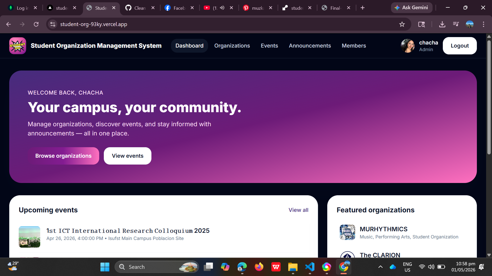
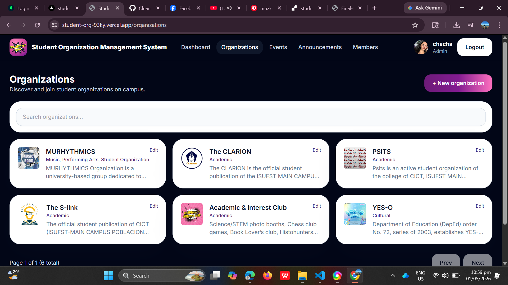
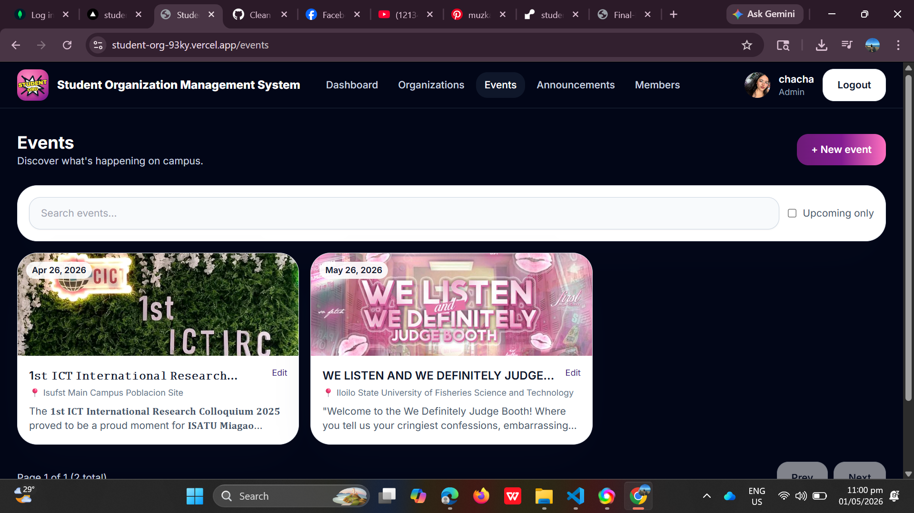
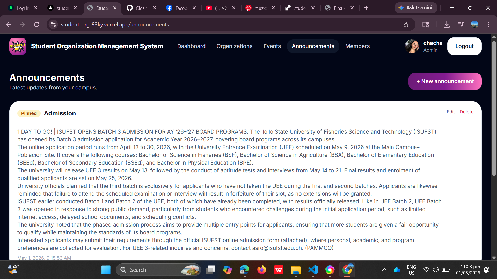
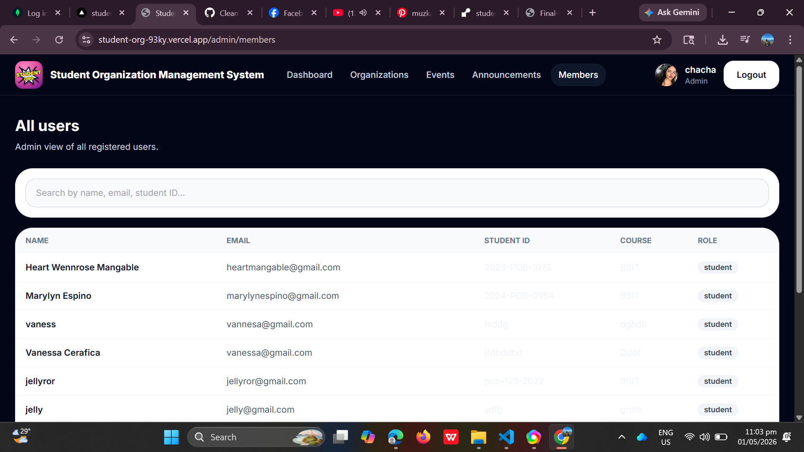

### API Testing

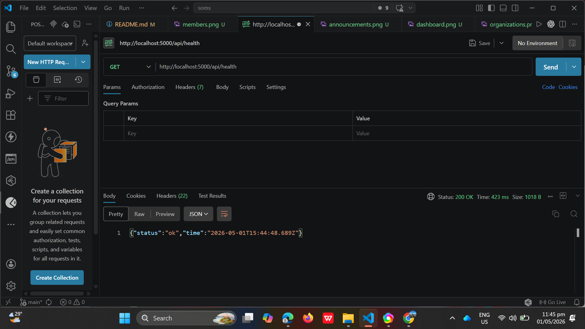
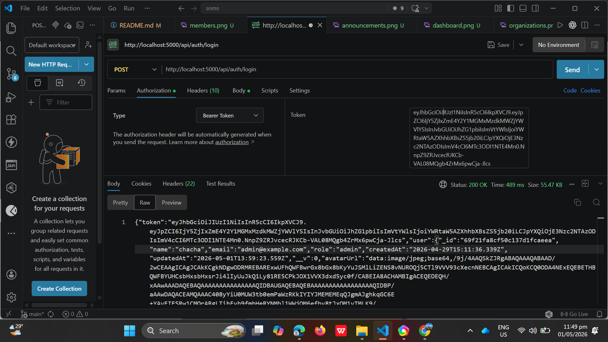
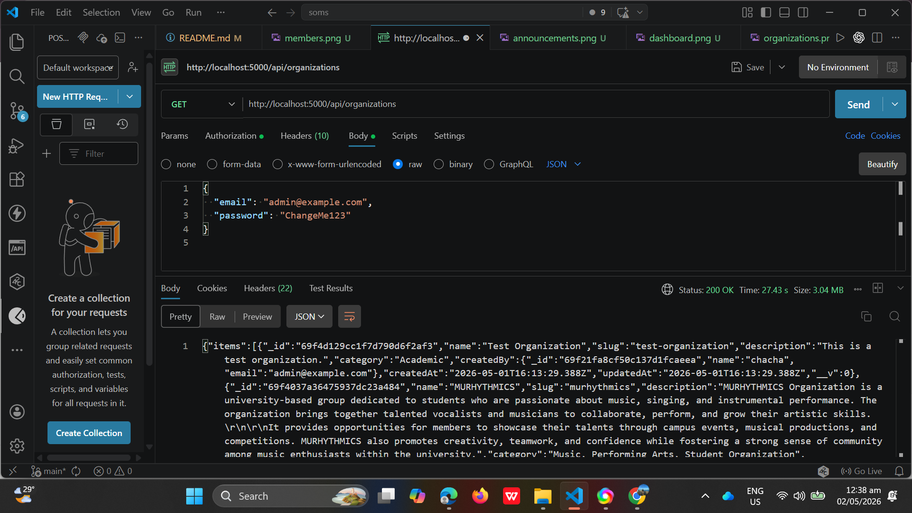
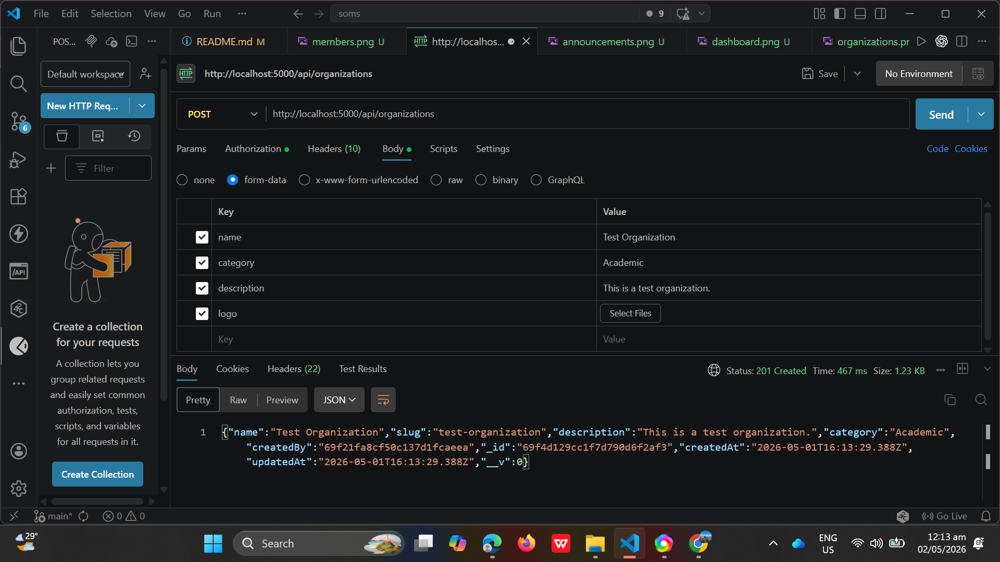
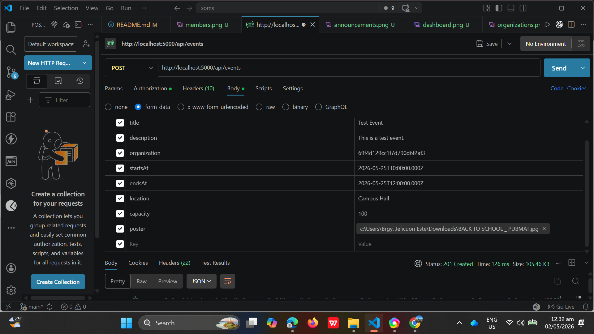
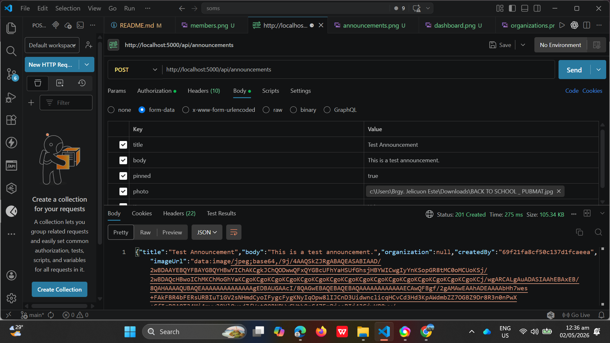
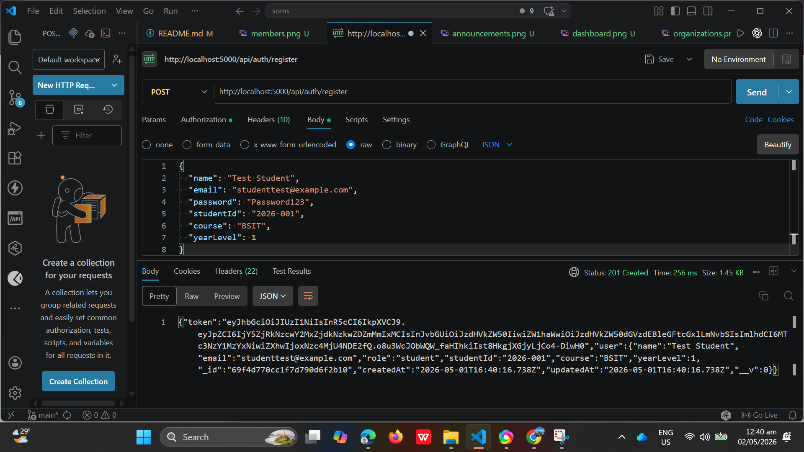
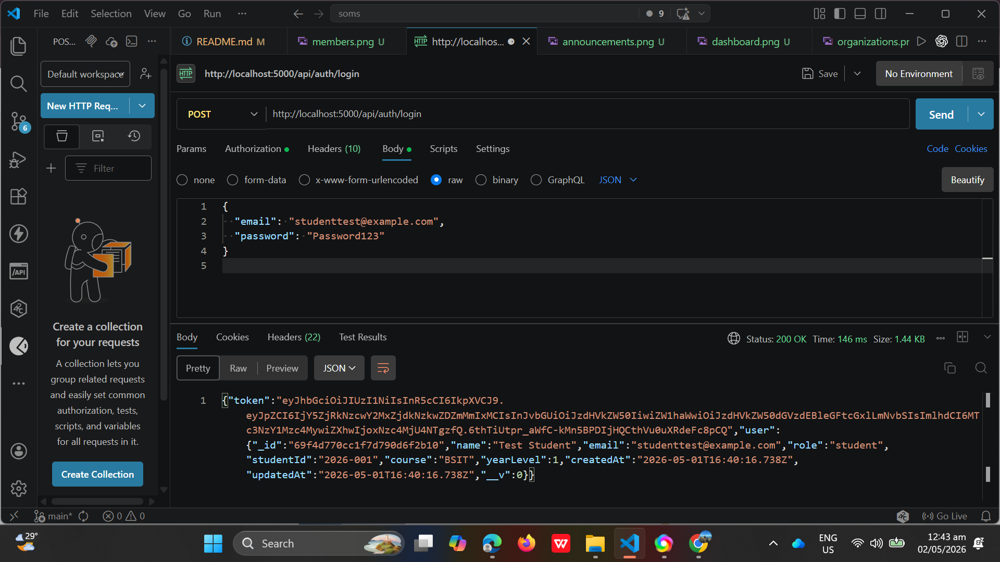
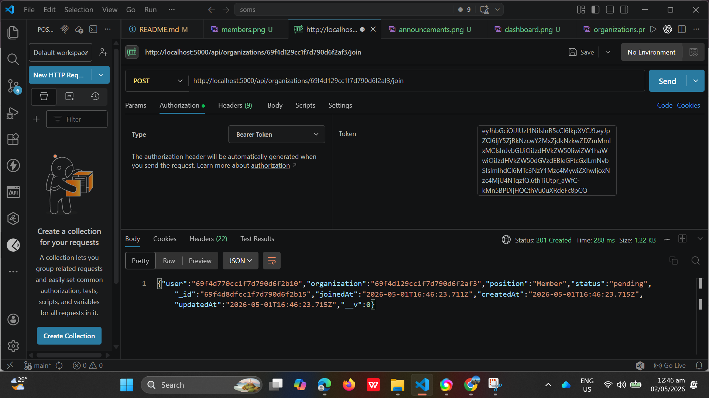
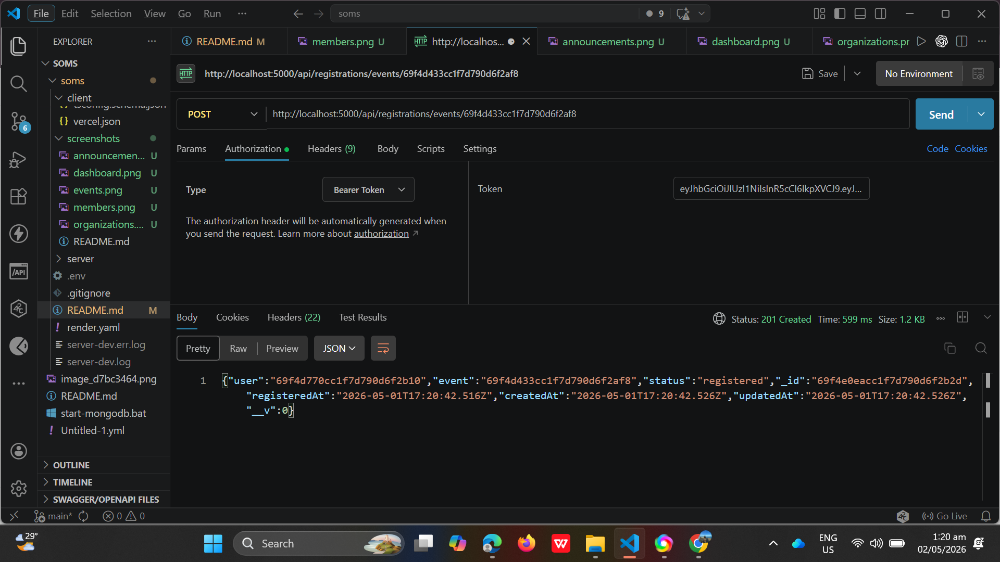

## Deployment

### Backend on Render

Build command:

```bash
npm install && npm run build
```

Start command:

```bash
npm start
```

Required environment variables:

```env
MONGO_URI=your_mongodb_connection_string
JWT_SECRET=your_jwt_secret
JWT_EXPIRES_IN=7d
CLIENT_ORIGIN=https://student-org-93ky.vercel.app
NODE_ENV=production
ADMIN_EMAIL=admin@example.com
ADMIN_PASSWORD=ChangeMe123
ADMIN_NAME=Admin
```

### Frontend on Vercel

Production API URL is configured in:

```text
client/src/environments/environment.ts
```

Use:

```ts
apiUrl: 'https://student-org-1-s1pk.onrender.com/api'
```

Build command:

```bash
npm install && npm run build
```

Output directory:

```text
dist/soms-client/browser
```
